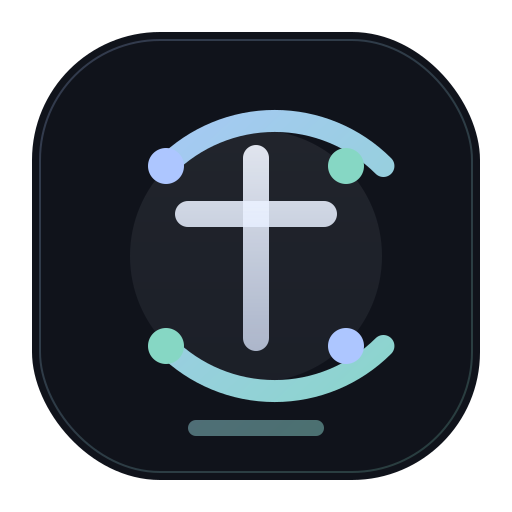

# TondID

TondID is a local Remote ID QA and mock-broadcast toolkit for ESP32-class boards. It combines:

- a Chrome/WebSerial configurator
- an ESP32 firmware build with mock swarm behavior
- helper scripts and documentation for repeatable local testing

## Structure

- `configurator/` — React-based local control surface served at `http://localhost:3000`
- `firmware/RemoteIDModule/` — ESP32 firmware source
- `firmware/libraries/` — bundled dependencies for firmware builds
- `docs/` — screenshots and supporting notes
- `scripts/qa-flash.ps1` — Windows helper for repeatable compile/upload
- `assets/tondid-mark.svg` — main brand mark
- `assets/tid-monogram.svg` — compact TID monogram for constrained placements

## Brand

- `TondID` is the primary product name
- `TID` is the compact display form for logos, printouts, badges, and other space-limited surfaces

## Local Configurator

Run the configurator from `configurator/` and connect to the board over WebSerial in Chrome.

## Firmware

The current firmware targets ESP32-C3 class boards and persists profile/runtime configuration to device storage.

## Notes

This repository is assembled from the active local TondID worktree and includes both the configurator and firmware material needed for ongoing QA development.
